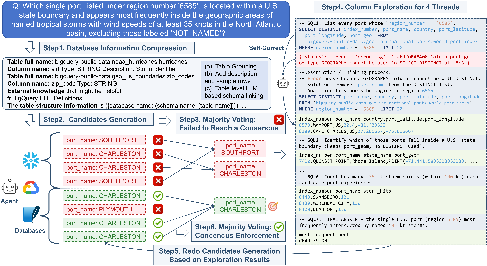

# ReFoRCE: A Text-to-SQL Agent with Self-**Re**finement, Consensus En**For**cement and **C**olumn **E**xploration

<p align="center">
| <a href="https://arxiv.org/pdf/2502.00675"><b>Paper</b></a> | <a href="https://hao-ai-lab.github.io/blogs/reforce/"><b>Blog</b></a> |
</p>

## News 🗞️
- **2025.05:** We are excited to release the formal version of **ReFoRCE**!

- **2025.03:** Our paper has been accepted to the ICLR 2025 VerifAI Workshop!

## Overview🔍


We present ReFoRCE, a Text-to-SQL agent that tops the Spider 2.0 leaderboard—a challenging benchmark reflecting complex, real-world Text-to-SQL scenarios. While Text-to-SQL systems enable natural language queries over structured databases, deploying them in enterprise environments remains difficult due to large, complex schemas (with over 1,000 columns), diverse SQL dialects (e.g., BigQuery, Snowflake), and sophisticated query requirements (e.g., transformations and analytics). ReFoRCE addresses these challenges through: (a) *database information compression* via pattern-based table grouping and LLM-guided schema linking to alleviate long-context issues; (b) *self-refinement* to iteratively correct syntax and semantic errors across dialects; (c) *majority-vote consensus* to select high-confidence candidates while deferring ambiguous cases arising from sophisticated queries; and (d) *iterative column exploration* guided by execution feedback to resolve those deferred cases. ReFoRCE achieves new state-of-the-art results, with scores of 35.83 on Spider 2.0-Snow and 36.56 on Spider 2.0-Lite.

## Quick Start 🏁

### Folder Structure  
```
- 📁 data/                                  -- OmniSQL SQLite File and Schema Linking Results
- 📁 methods/  
  - 📁 ReFoRCE/                             -- Our Method  
    - 📁 scripts/                           -- Running Scripts  
    - 📄 agent.py                           -- Main Algorithm
    - 📄 chat.py                            -- GPT API Class 
    - 📄 eval.py                            -- Pass@k Eval   
    - 📄 get_metadata.py                    -- Retrieve SQLs and CSVs from Results  
    - 📄 prompt.py                          -- Prompts  
    - 📄 README.md                          -- Step-by-Step Running Instructions  
    - 📄 reconstruct_data.py                -- Data Preprocessing  
    - 📄 requirements.txt                   -- Dependencies  
    - 📄 run.py                             -- Main Function
    - 📄 schema_linking.py                  -- Table-level Schema Linking
    - 📄 spider_agent_setup_lite.py         -- Setup for Lite DB  
    - 📄 spider_agent_setup_snow.py         -- Setup for Snow DB  
    - 📄 sql.py                             -- SQL Execution Class  
    - 📄 utils.py                           -- Utility Functions  
    - 📄 *_credential.json                  -- Place Credentials Here  
- 📁 spider2-lite/                          -- Spider2-lite DB and Evaluation (copy from Spider2 Repo)  
- 📁 spider2-snow/                          -- Spider2-snow DB and Evaluation (copy from Spider2 Repo)  
```

**Note:** 
- For folders `spider2-lite` and `spider2-snow`, please obtain the latest version from the [Spider2 Repo](https://github.com/xlang-ai/Spider2). 
- The evaluation in this repository is based on execution results. Make sure to run the gold SQLs to get the latest results and place them in [Spider2-lite Exec Results Folder](spider2-lite/evaluation_suite/gold/exec_result) and [Spider2-snow Exec Results Folder](spider2-snow/evaluation_suite/gold/exec_result) respectively; otherwise, performance may drop a bit due to changes in the database and updates from Spider 2.0.

### Setup ⚙️  
Navigate to the ReFoRCE method folder:  
```bash
cd methods/ReFoRCE
```

Install Dependencies:
```
conda create -n reforce python=3.10 -y
conda activate reforce
pip install -r requirements.txt
```

Credentials Setup: Place your `snowflake_credential.json` and `bigquery_credential.json` in the methods/ReFoRCE folder. Obtain your credentials from the [Spider2 Repo](https://github.com/xlang-ai/Spider2).

### Scripts 🚀

Currently we support GPT Family API.

#### Main
- **Run Snow with OPENAI_API_KEY:**
```bash
export OPENAI_API_KEY=YOUR_API_KEY
bash scripts/run_main.sh --task snow --model o3
```

- **Run Snow with AZURE_OPENAI_KEY:**
```bash
export AZURE_ENDPOINT=YOUR_AZURE_ENDPOINT
export AZURE_OPENAI_KEY=YOUR_AZURE_API_KEY
bash scripts/run_main.sh --task snow --model o3 --azure
```

- **Run Lite with OPENAI_API_KEY:**
```bash
export OPENAI_API_KEY=YOUR_API_KEY
bash scripts/run_main.sh --task lite --model o3
```

- **Run Lite with AZURE_OPENAI_KEY:**
```bash
export AZURE_ENDPOINT=YOUR_AZURE_ENDPOINT
export AZURE_OPENAI_KEY=YOUR_AZURE_API_KEY
bash scripts/run_main.sh --task lite --model o3 --azure
```

These scripts also show results after:
1. Self-refinement + Majority Voting.
2. Self-refinement + Majority Voting + Column Exploration + Rerun.
3. Random vote for tie.
4. Random vote final_choose

- **Run Pass@k Evaluation**
```bash
bash scripts/run_eval.sh --task {lite, snow} --log_folder {YOUR_LOG_FOLDER}
```

Note that `--update` is optional, denoting whether to run gold SQLs to update the results.

#### Ablations
- **Run Column Exploration Only:**
```bash
bash scripts/ablation/run_CE.sh --azure --task {lite, snow} --model o3
```

- **Run Without Column Exploration:**
```bash
bash scripts/ablation/run_no_col.sh --azure --task {lite, snow} --model o3
```

- **Run Without Database Information Compression:**
```bash
bash scripts/ablation/run_no_compression.sh --azure --task {lite, snow} --model o3
```

- **Run OmniSQL Format w & w/o OpenSearchSQL Schema Linking:**
```bash
bash scripts/ablation/run_omnisql_format_no_col.sh o3
bash scripts/ablation/run_omnisql_format_CE.sh o3
```

- **Run With Gold Table:**
Get gold tables from [Spider2 Repo](https://github.com/xlang-ai/Spider2) and add the `gold_table_pth` in `scripts/ablation/run_gold_table.sh`.

```bash
bash scripts/ablation/run_gold_table.sh --azure --task {lite, snow} --model o3
```

- **Run With Gold Schema:**
Just based on released gold SQLs.

```bash
bash scripts/ablation/run_gold_schema.sh --azure --task {lite, snow} --model o3
```

## Acknowledgements ✨
This work is jointly developed with [Snowflake AI Research Team](https://www.snowflake.com/en/product/ai/ai-research/).


## Citation 📝
If you find this repository helpful, please cite our work:
```bibtex
@article{deng2025reforce,
  title={ReFoRCE: A Text-to-SQL Agent with Self-Refinement, Format Restriction, and Column Exploration},
  author={Deng, Minghang and Ramachandran, Ashwin and Xu, Canwen and Hu, Lanxiang and Yao, Zhewei and Datta, Anupam and Zhang, Hao},
  journal={arXiv preprint arXiv:2502.00675},
  year={2025}
}
```