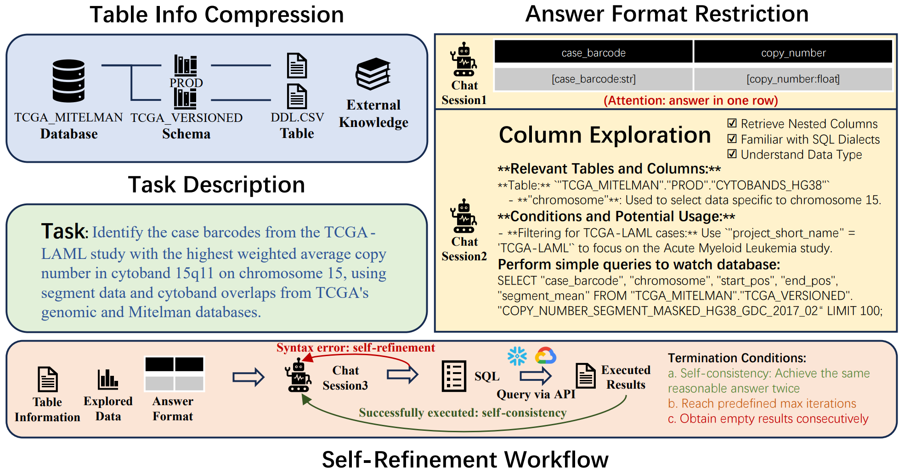

# ReFoRCE: A Text-to-SQL Agent with Self-Refinement, Format Restriction, and Column Exploration

<p align="center">
| <a href="https://arxiv.org/pdf/2502.00675"><b>Paper</b></a> | <a href="https://hao-ai-lab.github.io/blogs/reforce/"><b>Blog</b></a> |
</p>

## News 🗞️
- **2025.04:** We are excited to release the code for **ReFoRCE**!

- **2025.03:** Our paper has been accepted to the ICLR 2025 VerifAI Workshop!

## Overview🔍


This repository accompanies our paper on **ReFoRCE**—a novel Text-to-SQL system designed to overcome key challenges in deploying natural language query interfaces in enterprise settings. The system tackles issues arising from large, complex database schemas, diverse SQL dialects, and sophisticated query requirements by incorporating: **Table Compression** for improved long-context handling; **Format Restriction** to ensure precise answer structures; and **Iterative Column Exploration** for enhanced schema understanding. Additionally, **ReFoRCE** introduces a self-refinement pipeline featuring parallelized workflows with voting mechanisms. These innovations have enabled the system to surpass the current state-of-the-art on the Spider 2.0 benchmark, achieving scores of **31.26** on Spider 2.0-Snow and **30.35** on Spider 2.0-Lite, thus unlocking more effective access to critical data insights in complex enterprise environments.

## Quick Start 🏁

### Folder Structure  
```
- 📁 methods/  
  - 📁 ReFoRCE/                             -- Our Method  
    - 📁 scripts/                           -- Running Scripts  
    - 📄 agent.py                           -- Main Algorithm  
    - 📄 chat.py                            -- GPT API Class  
    - 📄 get_metadata.py                    -- Retrieve SQLs and CSVs from Results  
    - 📄 prompt.py                          -- Prompts  
    - 📄 README.md                          -- Step-by-Step Running Instructions  
    - 📄 reconstruct_data.py                -- Data Preprocessing  
    - 📄 requirements.txt                   -- Dependencies  
    - 📄 run.py                             -- Main Function  
    - 📄 spider_agent_setup_lite.py         -- Setup for Lite DB  
    - 📄 spider_agent_setup_snow.py         -- Setup for Snow DB  
    - 📄 sql.py                             -- SQL Execution Class  
    - 📄 utils.py                           -- Utility Functions  
    - 📄 *_credential.json                  -- Place Credentials Here  
- 📁 spider2-lite/                          -- Spider2-lite DB and Evaluation (copied from Spider2 Repo)  
- 📁 spider2-snow/                          -- Spider2-snow DB and Evaluation (copied from Spider2 Repo)  
```

**Note:** 
- For folders `spider2-lite` and `spider2-snow`, please obtain the latest version from the [Spider2 Repo](https://github.com/xlang-ai/Spider2). 
- The evaluation in this repository is based on execution results. Make sure to run the gold SQLs to get the latest results and place them in [Spider2-lite Exec Results Folder](spider2-lite/evaluation_suite/gold/exec_result) and [Spider2-snow Exec Results Folder](spider2-snow/evaluation_suite/gold/exec_result) respectively; otherwise, performance may drop a bit due to changes in the database.

## Setup ⚙️  
Navigate to the ReFoRCE method folder:  
```bash
cd methods/ReFoRCE
```

Install Dependencies:
```
conda create -n reforce python=3.10 -y
conda activate reforce
pip install -r requirements.txt
```

Credentials Setup: Place your snowflake_credential.json and bigquery_credential.json in the methods/ReFoRCE folder. Obtain your credentials from the [Spider2 Repo](https://github.com/xlang-ai/Spider2).

## Scripts 🚀

Currently we only support o1-preview API.

- **Run Snow with OPENAI_API_KEY:**
```bash
export OPENAI_API_KEY=YOUR_API_KEY
bash scripts/run_snow.sh
```

- **Run Snow with AZURE_OPENAI_KEY:**
```bash
export AZURE_ENDPOINT=YOUR_AZURE_ENDPOINT
export AZURE_OPENAI_KEY=YOUR_AZURE_API_KEY
bash scripts/run_snow_azure.sh
```

- **Run Lite with OPENAI_API_KEY:**
```bash
export OPENAI_API_KEY=YOUR_API_KEY
bash scripts/run_lite.sh
```

- **Run Lite with AZURE_OPENAI_KEY:**
```bash
export AZURE_ENDPOINT=YOUR_AZURE_ENDPOINT
export AZURE_OPENAI_KEY=YOUR_AZURE_API_KEY
bash scripts/run_lite_azure.sh
```

For more details, please refer to [ReFoRCE README](methods/ReFoRCE/README.md).

# Acknowledgements
This work is jointly developed with [Snowflake AI Research Team](https://www.snowflake.com/en/product/ai/ai-research/).


# Citation 📝
If you find this repository helpful, please cite our work:
```bibtex
@article{deng2025reforce,
  title={ReFoRCE: A Text-to-SQL Agent with Self-Refinement, Format Restriction, and Column Exploration},
  author={Deng, Minghang and Ramachandran, Ashwin and Xu, Canwen and Hu, Lanxiang and Yao, Zhewei and Datta, Anupam and Zhang, Hao},
  journal={arXiv preprint arXiv:2502.00675},
  year={2025}
}
```